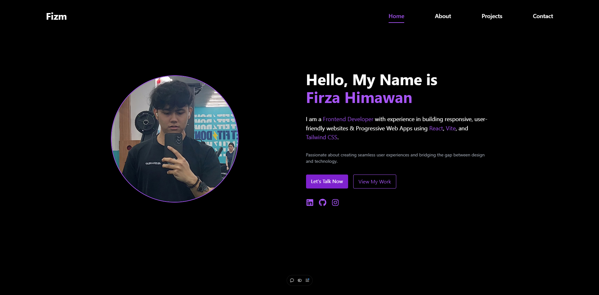

# My Portfolio Website 🌐

A modern and responsive portfolio website built using React, Vite, and Tailwind CSS. This website showcases my skills, projects, and contact information with smooth animations and an elegant design.

click [here](https://fizmportfolio.vercel.app) to the website

<p align="center">
  
</p>

## Features ✨

- **Responsive Design**: Optimized for all devices, including desktops, tablets, and mobile phones.
- **Smooth Animations**: Powered by [AOS (Animate on Scroll)](https://michalsnik.github.io/aos/).
- **Dynamic Contact Form**: Integrated with [EmailJS](https://www.emailjs.com/) to handle email submissions seamlessly.
- **Interactive Project Filtering**: Filter projects based on technologies or categories.
- **Google Maps Integration**: Embedded map for location information.
- **Clean & Modern UI**: Dark-themed design with a touch of vibrant purple accents.

---

## Tech Stack 🛠️

- **Frontend**:
  - [React](https://reactjs.org/)
  - [Vite](https://vitejs.dev/)
  - [Tailwind CSS](https://tailwindcss.com/)

- **Backend Services**:
  - [EmailJS](https://www.emailjs.com/) for contact form submissions.

- **Animations**:
  - [AOS (Animate on Scroll)](https://michalsnik.github.io/aos/) for scroll animations.

---

## Sections 📄

### 1. **Home**
   - Introduction and hero section with typing animations.
   - Buttons to navigate to the "Projects" and "Contact" sections.

### 2. **About**
   - Detailed introduction about myself, including skills and fun facts.
   - Tech stack section to showcase the technologies I use.

### 3. **Projects**
   - Displays my projects with filters for easy navigation.
   - Includes project details and technologies used.

### 4. **Contact**
   - Contact information and a working contact form.
   - Embedded Google Maps for location details.

---

## Installation 🚀

1. Clone the repository:
   ```bash
   git clone https://github.com/yourusername/your-repo-name.git
   ```
2. Navigate to the project directory:
   ```bash
   cd your-repo-name
   ```
3. Install dependencies:
   ```bash
   npm install
   ```
4. Start the development server:
   ```bash
   npm run dev
   ```
5. Open the project in your browser:
   ```bash
   http://localhost:5173
   ```

---

## Deployment 🌍

The website is deployed using [Vercel](https://vercel.com/). You can deploy your project by following these steps:

1. Push your code to a GitHub repository.
2. Connect your repository to Vercel.
3. Set up a build command:
   ```
   npm run build
   ```
4. Deploy and share your portfolio link!

---

## Usage ⚡

- Click **"View My Work"** on the Home page to explore projects.
- Use the filter buttons on the Projects page to narrow down project categories.
- Fill out the contact form to send a message via EmailJS.

---

## Folder Structure 📂

```plaintext
src/
├── components/
│   ├── Navbar.jsx
│   ├── Home/
│   │   └── Hero.jsx
│   ├── About/
│   │   ├── Introduction.jsx
│   │   ├── Skills.jsx
│   │   └── FunFact.jsx
│   ├── projects/
│   │   ├── Filters.jsx
│   │   ├── List.jsx
│   │   ├── Modal.jsx
│   │   └── Card.jsx
│   └── contact/
│       ├── ContactForm.jsx
│       ├── ContactInfo.jsx
│       └── GoogleMaps.jsx
├── pages/
│   ├── Home.jsx
│   ├── About.jsx
│   ├── Projects.jsx
│   └── Contact.jsx
├── App.jsx
└── main.jsx
```

---

## License 📜

This project is licensed under the [Apache License](LICENSE).

---

## Contact Me 📧

Feel free to connect with me:
- **Email**: [himawanfirza21@gmail.com](mailto:himawanfirza21@gmail.com)
- **LinkedIn**: [Firza Himawan](https://www.linkedin.com/in/firzahimawan/)
- **GitHub**: [Fizm00](https://github.com/Fizm00)
- **Instagram**: [firza_hmn](https://www.instagram.com/firza_hmn/)

---
